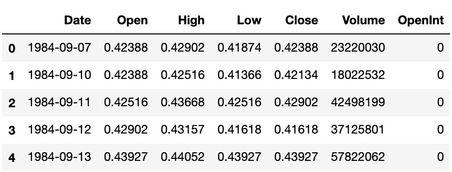

# Stock Predicition Using LSTM RNN

This project is a basic attempt at training my own model and came about from my interest in the fields of computer science and economics and combining the two. This model predicts Apple stock with data from 1984 to 2016 with values for date, open, high, low, close, volume, and open interest.



For simplification, only the opening price was taken into consideration so the data looked a little more like this:


## Model Design

Recurrent Neural Networks are a good choice of model for problems that work with sequences of information or sequential data. For this reason, RNNs are good for predicting stock data because predictions are largely dependent on prices from previous days. RNNs are fine when dealing with short term input but are less effective when considering input of longer scale or context from long ago. So the solution is this:


The password is hashed and stored in a binary file in lieu of a database for simplicity sake and because it isn't the main focus of the project. 

## Getting Started

These instructions will get you a copy of the project up and running on your machine for testing purposes.

### Setup

What things you need to install the software and how to install them.

```
pip install -r requirements.txt
```

Add images to the 'faces' folder as profiles of people you would like the system to be able to recognize. Make sure the file format is either jpg or png.

## Running

Change directory to the project directory and run the following command:

```
python MakeBinaryFile.py
```

This sets up the password for the program. You can go in the code and change it to whatever you want. For the program to actually work you will need your own AWS Access Key ID and Secret Access Key as well as your own S3 buckets. To actually run the program just run the following command:

```
python FacialVoiceLock.py
```

Instructions will pop up in terminal as you go guiding you through the process of "logging in" using facial and voice recognition.


## Built With

* [face_recognition](https://pypi.org/project/face_recognition/) - Recognize faces from Python or from the command line
* [OpenCV](https://pypi.org/project/opencv-python/) - Wrapper package for OpenCV python bindings
* [NumPy](https://numpy.org/) - Useful for higher level mathematical functions
* [Passlib](https://pypi.org/project/passlib/) - Password hashing library
* [Boto3](https://pypi.org/project/boto3/) - Amazon Web Services (AWS) Software Development Kit (SDK) for Python
* [Amazon S3](https://aws.amazon.com/s3/?nc2=h_ql_prod_fs_s3) - Scalable storage in the cloud
* [Amazon Transcribe](https://aws.amazon.com/transcribe/?nc2=h_ql_prod_ml_ts) - Automatic speech recognition
* [Amazon Lambda](https://aws.amazon.com/lambda/?nc2=h_ql_prod_cp_lbd) - Run code based on triggers

## Acknowledgements
* [Tech With Tim](https://techwithtim.net/)
* [Tech Tunes](https://www.thetechnologyupdates.com/)
