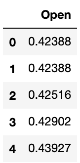

# Stock Predicition Using LSTM RNN

This project is a basic attempt at training my own model and came about from my interest in the fields of computer science and economics and combining the two. This model predicts Apple stock with data from 1984 to 2016 with values for date, open, high, low, close, volume, and open interest.


For simplification, only the opening price was taken into consideration so the data looked a little more like this:

<p align="center">
  
</p>

## Model Design

Recurrent Neural Networks are a good choice of model for problems that work with sequences of information or sequential data. For this reason, RNNs are good for predicting stock data because predictions are largely dependent on prices from previous days. RNNs are fine when dealing with short term input but are less effective when considering input of longer scale or context from long ago. So the solution is this:


Long short term memory helps to make little modifications to the info through its cell states. LSTMs help to remember and forget things as they go which makes them useful for this situation. 

The model contains four LSTM layers with dropout regularisation and a single output layer. The model is compiled using the Adam optimization algorithm and loss calculated using mean squared error.

## Results


The figure above shows the model's predicition of 2017 stock alongside the real stock price.

## Getting Started

These instructions will get you a copy of the project up and running on your machine for testing purposes.

### Setup

What things you need to install the software and how to install them.

```
pip install -r requirements.txt
```

You can use your own stock data but will have to make sure it's processed correctly to fit the program.

## Running

Change directory to the project directory and run the following command:

```
python model.py
```

This will train the model and then run the prediction and show you the graph of the results.

## Built With

* [NumPy](https://numpy.org/) - Useful for higher level mathematical functions
* [Matplotlib](https://matplotlib.org/) - Python 2D plotting library
* [pandas](https://pandas.pydata.org/) - Data structures and data analysis tools for Python
* [Scikit-learn](https://scikit-learn.org/stable/) - Simple and efficient tools for predictive data analysis
* [Keras](https://keras.io/) - Open-source neural-network library written in Python
* [TensorFlow](https://www.tensorflow.org/) - End-to-end open source platform for machine learning

## Acknowledgements
* [Analytics Vidhya](https://www.analyticsvidhya.com/blog/2017/12/fundamentals-of-deep-learning-introduction-to-lstm/)
* [Towards Data Science](https://towardsdatascience.com/illustrated-guide-to-recurrent-neural-networks-79e5eb8049c9)
* [colah's blog](https://colah.github.io/posts/2015-08-Understanding-LSTMs/)
* [Kaggle Stock Dataset](https://www.kaggle.com/borismarjanovic/price-volume-data-for-all-us-stocks-etfs)

